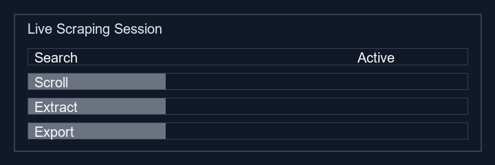

# 🗺️ Maps Harvester V3

## Google Maps Lead Extraction + Webhook Export


**Maps Harvester V3** is a lightweight Manifest V3 Chrome extension that extracts business leads from Google Maps search results, enriches them with website data, and exports them through webhooks or local CSV.

## 📌 Quick Links

- [Overview](#overview)
- [Features](#features)
- [Architecture](#architecture)
- [Data Schema](#data-schema)
- [User Flow](#user-flow)
- [Installation](#installation)
- [Usage](#usage)
- [Webhook Export](#webhook-export)
- [Development](#development)
- [License](#license)

---

## Overview

Maps Harvester injects a smart scraping engine directly into Google Maps results. It captures business details, deduplicates leads, performs deep website enrichment, and delivers export-ready data with a modern side panel UI.



---

## Features

- **Google Maps scraping**: extracts business name, category, address, phone, website, rating, and reviews.
- **Deep enrichment**: crawls lead websites and contact pages for email and social profiles.
- **Duplicate protection**: skips duplicate businesses using `masterHistory`.
- **Webhook export**: send leads to n8n, Zapier, Make, or any HTTP endpoint.
- **Local CSV export**: download your data with optional email filtering.
- **Minimal UI**: side panel UX with live logging, counters, and controls.

---

## Architecture

| File                | Purpose                                                                       |
| ------------------- | ----------------------------------------------------------------------------- |
| `manifest.json`     | Extension metadata, permissions, and side panel configuration.                |
| `sidepanel.html`    | UI markup and styling for the Chrome side panel.                              |
| `sidepanel.js`      | Controls button actions, storage, webhook posting, and CSV export.            |
| `content.js`        | Scraper injected into Google Maps to collect lead data and scroll results.    |
| `service_worker.js` | Background lead processing, deduplication, website crawl, and CSV generation. |

---

## Data Schema

Harvested leads are stored in Chrome local storage and generally include:

```json
{
  "id": "String",
  "name": "String",
  "category": "String",
  "address": "String",
  "phone": "String",
  "website": "String",
  "rating": "String",
  "reviews": "String",
  "email": "String",
  "socials": "String"
}
```

Additional state tracked by the extension:

- `masterHistory`: deduplication history.
- `skippedCount`: duplicate lead counter.
- `isScraping`: current scraping status.

---

## User Flow

1. Open Google Maps and search for a business category or location.
2. Open the Maps Harvester side panel.
3. Set your target lead limit.
4. Click **Start Scraping**.
5. Watch the live logs, counter updates, and duplicate handling.
6. Export results via webhook or CSV.

---

## Installation

1. Clone this repository or download the folder.
2. Go to `chrome://extensions` in Chrome.
3. Enable **Developer mode**.
4. Click **Load unpacked** and select the `MapsHarvester` folder.
5. Open Google Maps and perform a search.

---

## Usage

1. Open the extension side panel.
2. Enter the desired lead limit.
3. Click **Start Scraping** while on a Google Maps results page.
4. Monitor the live terminal log and lead counters.
5. Use **Trigger Webhook to Sheets** to deliver data to your webhook.
6. Use **Download Local CSV** to export the collected leads.

---

## Webhook Export

The extension sends harvested leads in JSON format:

```json
{
  "source": "MapsHarvester",
  "leads": [ ... ]
}
```

This payload can be consumed by n8n, Zapier, Make, or any webhook-enabled automation.

---

## Development

- Use Chrome DevTools to inspect `sidepanel.html` and `sidepanel.js`.
- Update `content.js` if Google Maps markup changes.
- Extend `service_worker.js` for extra enrichment or new export formats.

---

## License

This repository does not currently include a license. Add one before sharing or publishing publicly.
